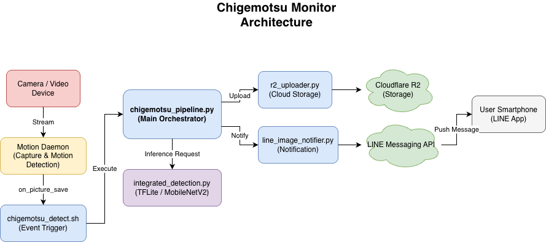

# Chigemotsu Monitor

Raspberry Pi Zero上で動作する、猫（ちげ・もつ）識別およびLINE通知システムです。
Motionと連携し、撮影された画像をTensorFlow Liteモデルで解析、特定個体を検出した場合に通知を行います。

## 特徴

*   **軽量AI推論**: Raspberry Pi Zero (ARMv6) 向けのTensorFlow Lite Microモデルを採用。
*   **自動通知**: 検出結果をLINEで画像付き通知。
*   **クラウド連携**: 画像をCloudflare R2へ自動バックアップ。
*   **Motion連携**: `motion` デーモンからのイベントフックで自動動作。

## 🏗️ システム構成



```
.
├── 📁 config/                        # 設定ファイル
│   ├── config.json                   # メイン設定
├── 📁 scripts/                       # 実行スクリプト
│   ├── chigemotsu_pipeline.py        # 推論→通知統合パイプライン
│   └── integrated_detection.py       # TensorFlow Lite推論エンジン
├── 📁 models/                        # AIモデル
├── 📁 logs/                          # ログファイル
├── 📁 docs/                          # ドキュメント
├── 📁 setup/                         # セットアップスクリプト
└── 📁 tools/                         # 開発・変換ツール
```

## クイックスタート

### 1. インストール
```bash
git clone https://github.com/junkei-okinawa/chigemotsu-monitor.git
cd chigemotsu-monitor
./setup/install.sh
```

> [!CAUTION]
> **注意**: Raspberry Pi Zero では `numpy` などのパッケージをソースからビルドするため、`install.sh` の完了まで **2〜4時間程度** かかる場合があります。処理が止まっているように見えても、そのままお待ちください。

### 2. 設定
`config/` ディレクトリ内のサンプルファイルをコピーして認証情報を設定してください。

*   `line_credentials.json`: LINE Bot APIキーなど
*   `r2_credentials.json`: Cloudflare R2設定（任意）

### 3. 動作確認
```bash
# パイプラインのテスト実行
python scripts/chigemotsu_pipeline.py --test

# Systemdサービスの状態確認
# ※ 事前に `libcamerify` コマンドを提供するパッケージをインストールしておいてください
#    （詳細な手順は docs/DEPLOYMENT.md を参照）
sudo systemctl status libcamerify_motion
```

## ドキュメント

詳細な設定やコマンドリファレンスは `docs/` を参照してください。

*   [📖 コマンドリファレンス & 詳細仕様](docs/REFERENCE.md)
*   [🚀 デプロイ・運用ガイド](docs/DEPLOYMENT.md)
*   [⚙️ Motion連携設定](docs/MOTION_INTEGRATION.md)
*   [💬 LINE通知設定](docs/LINE_CREDENTIALS_SETUP.md)
*   [☁️ Cloudflare R2設定](docs/R2_CREDENTIALS_SETUP.md)

## ライセンス

MIT License - 詳細は [LICENSE](LICENSE) を参照